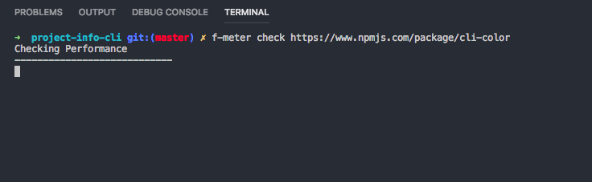
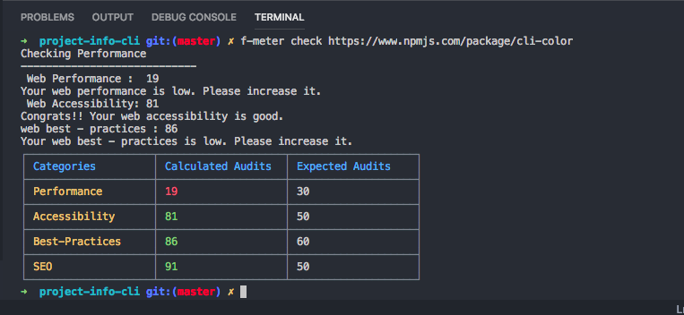
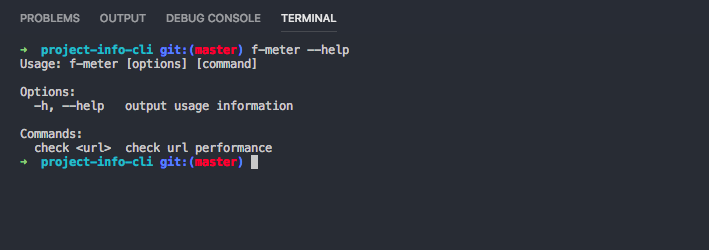

## f-meter 
- f-meter is a command line interface which gives project audits and performance
- Internally uses lighthouse
- Providing url of website to f-meter
  

- It will calculate the values of audits like performance,accessebility etc and compaires it with standard values of web audits .Showing the results of comparison as below :

